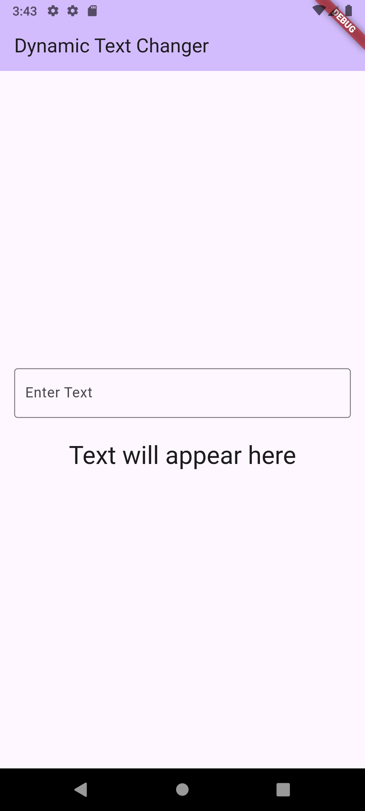

# Dynamic Text Changer

A simple Flutter application that demonstrates real-time UI updates. As you type into the text field, the text below it updates instantly. This project serves as a great example of using a `StatefulWidget` to manage and reflect UI changes based on user input.

## Features

- **Real-time Updates**: The display text changes character-by-character as the user types into the `TextField`.
- **State Management**: A basic but clear example of using `StatefulWidget` and `setState` to manage UI state.
- **Simple & Clean UI**: A focused interface built with Material Design widgets, including a `TextField` for input and a `Text` widget for output.

## Preview

The application displays a title "Dynamic Text Changer", a text input field with a label, and a text area below it. When a user types into the input field, the text below dynamically updates to mirror the input.



*To generate the preview above, run the application and capture a screenshot or a GIF. Save it as `preview.gif` inside a new `assets` folder in the root of your project.*

## Getting Started

This project is a starting point for a Flutter application.

### Prerequisites

Make sure you have the Flutter SDK installed on your machine. For instructions, see the online documentation.

### Running the Application

1.  Clone the repository or download the source code.
2.  Navigate to the project directory in your terminal.
3.  Install the necessary packages:
    ```sh
    flutter pub get
    ```
4.  Run the app on a connected device or emulator:
    ```sh
    flutter run
    ```

For more help with Flutter development, view the online documentation, which offers tutorials, samples, guidance on mobile development, and a full API reference.
